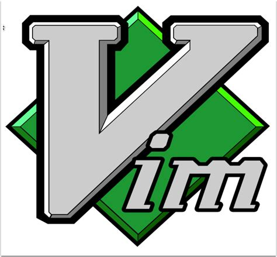
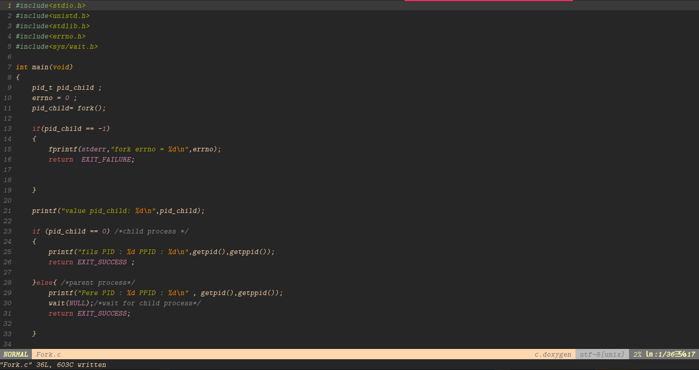
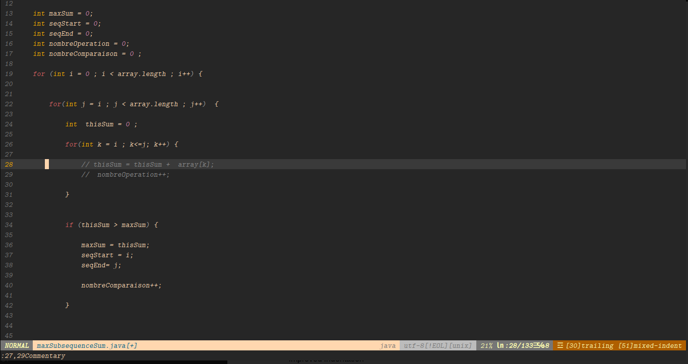

# vim 

my config ``.vimrc`` file 

- Basic: basic add config

``enable line number``

`` highlight cursor line ``
 
``undo file after save``

``continue at the last spot the last time you open the file``

``show matching words during search``

``enable smarindent to indent your code``

``Display all matching files with tab completion `` 

- Advance: if you wanna use Vim like a IDE this include a lot of useful plugins.

# Installation

``git clone https://github.com/DD7600/vimrc ``

``cd vimrc``

``./install.sh``

after plugins are install type ``:x`` to save and quit
 
by default this script save your old config to ``~/.vimrc.save`` if you wanna use your old config file

# RELEOAD OLD CONFIG
you can reload your base config by running this script

``cd vimrc``

``./old-config``

# Useful plugins already installed

## enable awesome theme ``gruvobx`` by default

## Dashborad

https://github.com/junegunn/vim-github-dashboard.git
Browse Github events (user dashboard,user/repo activity) in vim

type in vim
``:GHDashbord ``

or

``:GHDashbord USER ``
or 

``:GHActivity USER/REPO``

more information [click-here](https://github.com/junegunn/vim-github-dashboard.git)

## Commentary

https://github.com/tpope/vim-commentary
use to comments line inside vim
type in vim

``gc `` to comment line into the cursor

``gcc`` to comment a selection

``:27,29Commentary``

to comment line 27 to 29

## Airline
https://github.com/vim-airline/vim-airline give information about the file path,line,column,encoding ..

## syntastic
compile every time you save a file to see  errors on any type of file .c .cpp .html .java .py . . .

## Python mode
- Support Pyhton and 3.6+
- Syntax highlighting
- Run python code (<leader>r)
- Code refactoring

fore more information https://github.com/python-mode/python-mode

## javascript

https://github.com/pangloss/vim-javascript.git javascript plugins provide syntax highlighting and improved indentation

# More Plugins
if you wanna see more plugins available for vim
check [vim-plugins](https://github.com/gerardbm/vimrc)

# How to add plugins
open your vim config file ``~/.vimrc`` search for 
``call plug#begin()`` and ``call plug#end`` and add your respository vim plugins

like that
 
``call plug#begin()``

``Plug 'link to your plugin respository'``

``Plug 'https://github.com/ap/vim-css-color'``

``call plug#end``

after saving your file  type ``:PlugInstall`` to install plugins
## Issues
if there is any issues about installation please let me know